# Heart Disease Prediction — Final Project

A machine learning project to predict heart disease using the `heart_disease_uci.csv` dataset. It covers data cleaning, exploratory data analysis (EDA), and training/comparing several classification models.

## Contents
- `Final_Project.ipynb` — the full project notebook
- `images/` — charts generated during analysis and modeling

## Project Steps

### 1. Libraries Used
`pandas`, `numpy`, `matplotlib`, `seaborn`, `scikit-learn`

### 2. Data Cleaning
- Dropped irrelevant columns (`id`, `ca`)
- Imputed missing values (median for numeric columns, mode for categorical columns)
- Fixed invalid zero values in `trestbps` and `chol`
- Handled outliers using the IQR method
- Converted the target column `num` into a binary `target` (0 = no disease, 1 = disease present)

### 3. Exploratory Data Analysis (EDA)

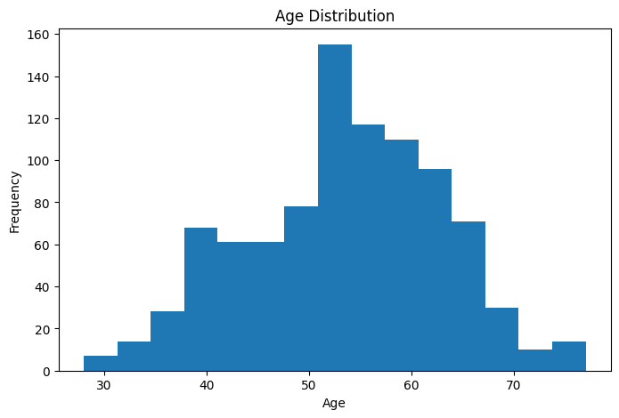

| Heart Disease Distribution | Age Distribution by Target |
|---|---|
| 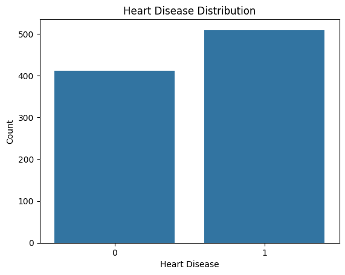 | 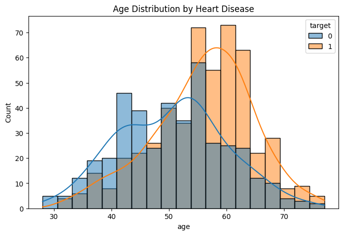 |

| Heart Disease by Sex | Chest Pain Type vs Target |
|---|---|
| 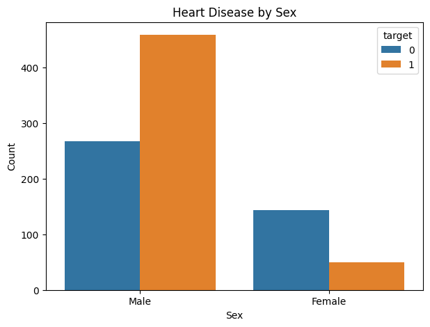 | 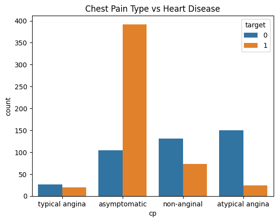 |

**Correlation Matrix:**

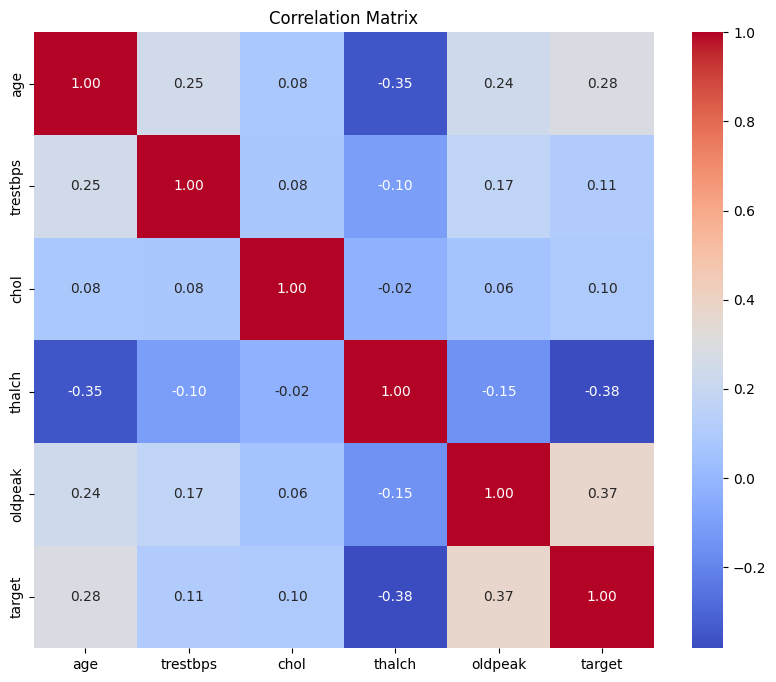

**Age / Cholesterol / Max Heart Rate / Resting BP vs Target:**

| | |
|---|---|
| 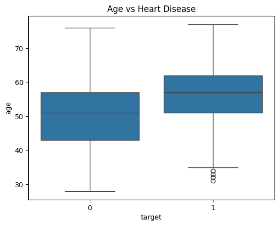 | 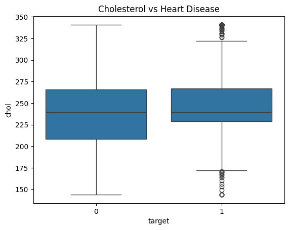 |
| 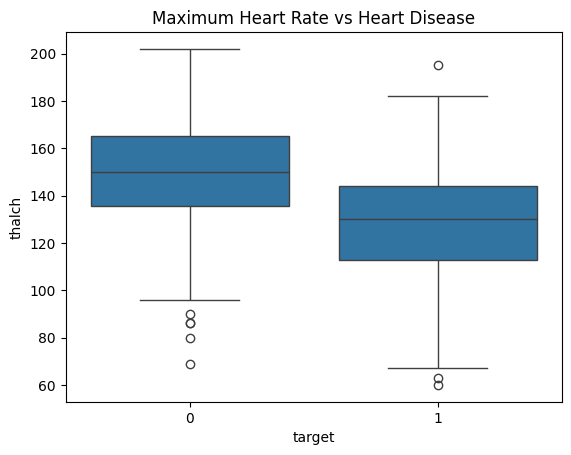 | 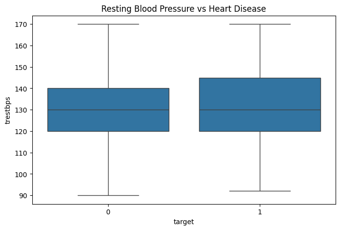 |

**Exercise-Induced Angina vs Target:**

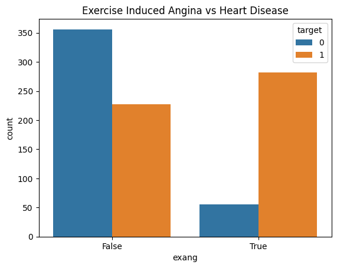

### 4. Modeling

Several classification models were trained and evaluated using an 80/20 train-test split with feature scaling (StandardScaler):

| Model | Train Accuracy | Test Accuracy |
|---|---|---|
| Logistic Regression | 0.8424 | 0.8261 |
| Linear Regression (baseline reference) | 0.8370 | 0.8370 |
| Naive Bayes | 0.8302 | 0.8207 |
| KNN (k=9) | 0.8492 | **0.8696** |
| Decision Tree | 0.8220 | 0.7935 |
| Random Forest | 0.8546 | 0.8424 |
| AdaBoost | 0.8383 | 0.8152 |

📌 **Best model: KNN (k=9)**, with a test accuracy of ≈ 87%

**KNN accuracy across different values of k:**

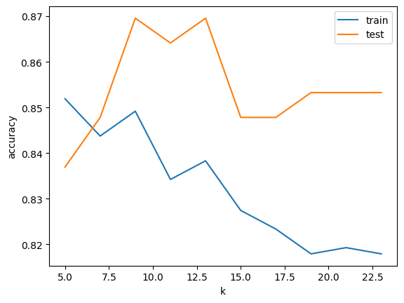

**Confusion Matrices:**

| Logistic Regression | Decision Tree |
|---|---|
| 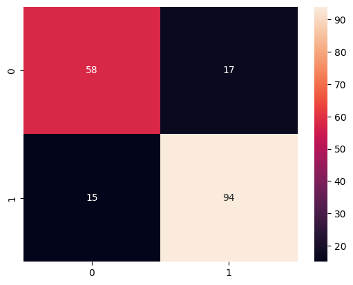 | 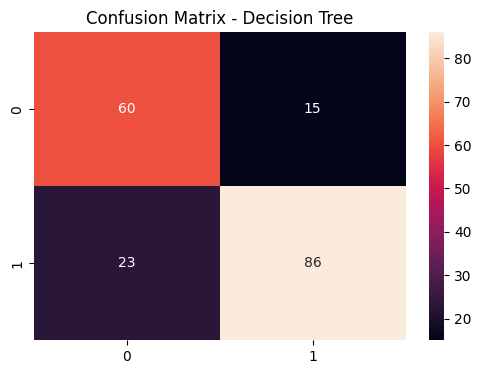 |

| Random Forest | AdaBoost |
|---|---|
| 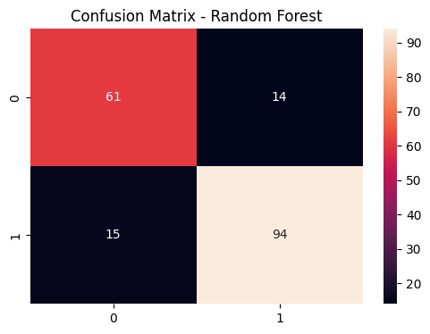 |  |

## How to Run
1. Install the required libraries:
```bash
   pip install pandas numpy matplotlib seaborn scikit-learn
```
2. Place the `heart_disease_uci.csv` file in the same directory as the notebook (or update the file path in the code).
3. Run the notebook cells in order, from top to bottom.

## Notes
- Linear Regression was included only as a comparison baseline, even though this is a classification problem and not the mathematically appropriate choice for it.
- Performance could likely be improved further with hyperparameter tuning (e.g., GridSearchCV) or by addressing class imbalance, if present.
 **Live Demo:** [Click here to try the app](https://heart-disease-prediction12.streamlit.app/)

## Features
- Age
- Sex
- Dataset (Source): Cleveland, Hungary, Switzerland, VA Long Beach
- Chest Pain Type (cp)
- Resting Blood Pressure (trestbps)
- Cholesterol (chol)
- Fasting Blood Sugar > 120 mg/dl (fbs)
- Resting ECG (restecg)
- Max Heart Rate Achieved (thalch)
- Exercise Induced Angina (exang)
- ST Depression (oldpeak)
- Slope of ST Segment (slope)
- Thalassemia (thal)

## Model
**Algorithm:** K-Nearest Neighbors (KNN, k=9) 
**Test Accuracy:** 86.96%

| Metric | Class 0 (No Disease) | Class 1 (Disease) |
|---|---|---|
| Precision | 0.83 | 0.90 |
| Recall    | 0.85 | 0.88 |
| F1-Score  | 0.84 | 0.89 |
